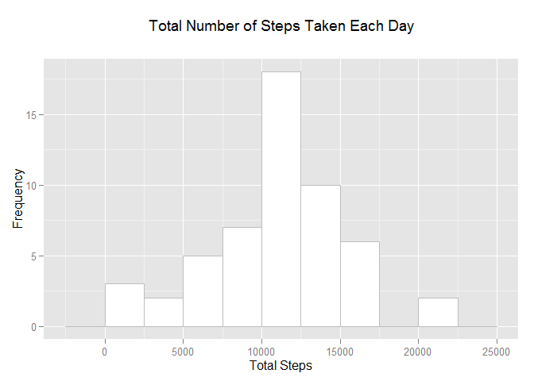
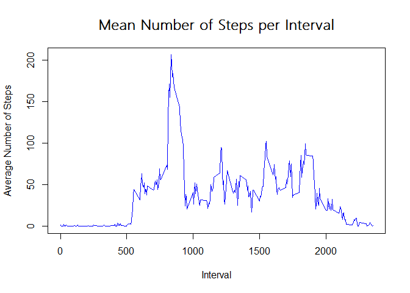
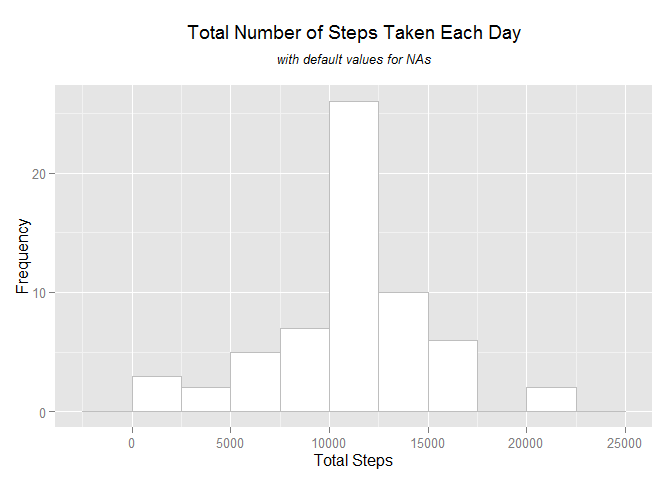
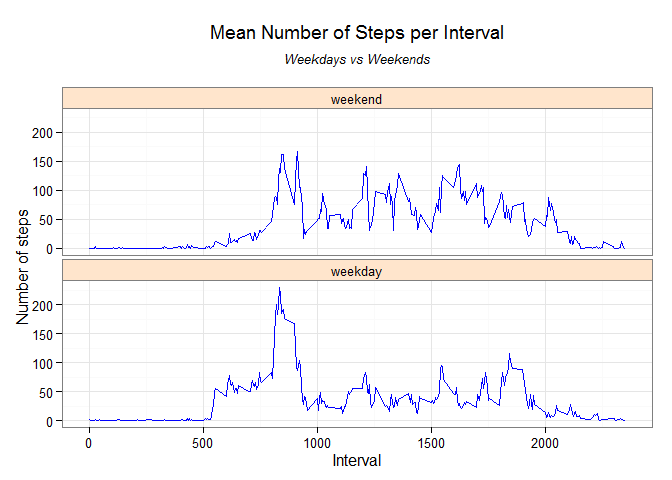

# Reproducible Research: Peer Assessment 1

This assignment makes use of data from a personal activity monitoring device. This device collects data at 5 minute intervals through out the day. The data consists of two months of data from an anonymous individual collected during the months of October and November, 2012 and include the number of steps taken in 5 minute intervals each day.

## Data
The data for this assignment can be downloaded from the course web site:

Dataset: [Activity monitoring data](http://tinyurl.com/om66otq) [52K in .zip format].

The variables included in this dataset are:

* __steps__: Number of steps taking in a 5-minute interval (missing values are coded as NA)

* __date__: The date on which the measurement was taken in YYYY-MM-DD format

* __interval__: Identifier for the 5-minute interval in which measurement was taken

The dataset is stored in a comma-separated-value (CSV) file and there are a total of 17,568 observations in this dataset.


## Loading and preprocessing the data
After downloading the dataset, make sure the decompressed file is in the same directory as this document.

Now let's read the dataset into memory:

```r
data <- read.csv("activity.csv", header=TRUE)
```

These are the first few lines of the file:

```
##   steps       date interval
## 1    NA 2012-10-01        0
## 2    NA 2012-10-01        5
## 3    NA 2012-10-01       10
## 4    NA 2012-10-01       15
## 5    NA 2012-10-01       20
```

This is a summary of the data loaded:

```
##      steps                date          interval     
##  Min.   :  0.00   2012-10-01:  288   Min.   :   0.0  
##  1st Qu.:  0.00   2012-10-02:  288   1st Qu.: 588.8  
##  Median :  0.00   2012-10-03:  288   Median :1177.5  
##  Mean   : 37.38   2012-10-04:  288   Mean   :1177.5  
##  3rd Qu.: 12.00   2012-10-05:  288   3rd Qu.:1766.2  
##  Max.   :806.00   2012-10-06:  288   Max.   :2355.0  
##  NA's   :2304     (Other)   :15840
```

The steps variable has NA values.  Let's create a second dataset that excludes these observations, for later use:

```r
dataWithoutNAs <- subset(data, !is.na(steps))
```

Let's also load the libraries we will later on use:

```
## Loading required package: data.table
## Loading required package: ggplot2
## Loading required package: plyr
```

## What is the Mean Total Number of Steps Taken per Day?

First, we will use ggplot2 to make a histogram of the total number of steps taken each day.  To accomplish this, we need to previously aggregate the number of steps taken per day, ignoring NA values in steps, like this:


```r
dt <- data.table(dataWithoutNAs)
dtAggregated <- dt[, list(TotalSteps = sum(steps)), by = date]
```

Let's visualize the aggregated data set:


```r
head(dtAggregated)
```

```
##          date TotalSteps
## 1: 2012-10-02        126
## 2: 2012-10-03      11352
## 3: 2012-10-04      12116
## 4: 2012-10-05      13294
## 5: 2012-10-06      15420
## 6: 2012-10-07      11015
```

```r
summary(dtAggregated)
```

```
##          date      TotalSteps   
##  2012-10-02: 1   Min.   :   41  
##  2012-10-03: 1   1st Qu.: 8841  
##  2012-10-04: 1   Median :10765  
##  2012-10-05: 1   Mean   :10766  
##  2012-10-06: 1   3rd Qu.:13294  
##  2012-10-07: 1   Max.   :21194  
##  (Other)   :47
```

Now the histogram:


```r
# declare the binwidth as a variable to be used in this and all future histograms
defaultBinwidth <- 2500
h <- ggplot(data=dtAggregated, aes(x=TotalSteps))
h <- h + geom_histogram(fill = "white", binwidth = defaultBinwidth, colour = "gray")
h <- h + ggtitle(expression(atop("Total Number of Steps Taken Each Day")))
h <- h + xlab("Total Steps") + ylab("Frequency")
h
```

 

Although present in the summary results shown above, with this code we can individually compute the mean and median number of steps taken per day:


```r
meanValue <- format(mean(dtAggregated$TotalSteps), nsmall = 2)
medianValue <- format(median(dtAggregated$TotalSteps), nsmall = 2)
```
The results are 10766.19 and 10765 steps, respectively.


## What is the Average Daily Activity Pattern?

We will plot the average daily pattern by averaging the number of steps taken per sampling interval.  For this we use the plyr library to create a dataset with the averages.  

```r
cdata <- ddply(dataWithoutNAs, c("interval"), summarise, avg=mean(steps))
with(cdata, plot(interval, avg, type="l", ylab ="Average Number of Steps", xlab = "Interval", col = "Blue"))
windowsFonts(S = "Segoe UI Light")
title(main = "Mean Number of Steps per Interval", family="S", cex.main = 1.5)
```

 

Please note that we created the summarized dataset from the original dataset with the NAs removed.

Sorting this summarized dataset by the _avg_ variable in descending order, we can get the interval that contains the maximum number of steps:

```r
head(arrange(cdata, -avg), 1)
```

```
##   interval      avg
## 1      835 206.1698
```


## Imputing Missing Values

### Number of missing values

The original dataset contains a number of missing values, coded as NAs in the _steps_ variable.  Above we created a new dataset with the corresponding observations removed.  To determine how many observations have NAs, we can simply substract the number of observations in the second dataset from those in the original dataset:


```r
originalNumberOfObservations <- nrow(data)
observationsWithoutNA <- nrow(dataWithoutNAs)
```
The total number of missing values in the original dataset is 2,304.

### Strategy for filling in all of the missing values in the dataset
To fill the missing values, we will use the mean of the number of steps for the corresponding interval.  For this we can use the previous dataset _cdata_ that has this mean calculated per interval.  These are the first 10 observations for that dataset:


```r
head(cdata)
```

```
##   interval       avg
## 1        0 1.7169811
## 2        5 0.3396226
## 3       10 0.1320755
## 4       15 0.1509434
## 5       20 0.0754717
## 6       25 2.0943396
```

### New dataset with the missing data filled in
We use the _merge_ function to do a side-by-side combination of the original dataset with the _cdata_ dataset, doing the combination using the _interval_ variable.  This way we can get a new dataset that includes all of the original variables in addition to the _avg_ variable from the _cdata_ dataset.


```r
dataFilled <- merge(x = data, cdata, by = "interval")
head(dataFilled)
```

```
##   interval steps       date      avg
## 1        0    NA 2012-10-01 1.716981
## 2        0     0 2012-11-23 1.716981
## 3        0     0 2012-10-28 1.716981
## 4        0     0 2012-11-06 1.716981
## 5        0     0 2012-11-24 1.716981
## 6        0     0 2012-11-15 1.716981
```

Now let's do a in-place replacement of the value in the _steps_ variable when its current value is NA.  The result is a new dataset with averages for steps that were NA:


```r
dataFilled$steps <- with(dataFilled, ifelse(is.na(steps), avg, steps))
head(dataFilled)
```

```
##   interval    steps       date      avg
## 1        0 1.716981 2012-10-01 1.716981
## 2        0 0.000000 2012-11-23 1.716981
## 3        0 0.000000 2012-10-28 1.716981
## 4        0 0.000000 2012-11-06 1.716981
## 5        0 0.000000 2012-11-24 1.716981
## 6        0 0.000000 2012-11-15 1.716981
```

Now let's drop the _avg_ variable.  We will not be using it anymore:

```r
dataFilled <- subset(dataFilled, select = -c(avg))
head(dataFilled)
```

```
##   interval    steps       date
## 1        0 1.716981 2012-10-01
## 2        0 0.000000 2012-11-23
## 3        0 0.000000 2012-10-28
## 4        0 0.000000 2012-11-06
## 5        0 0.000000 2012-11-24
## 6        0 0.000000 2012-11-15
```

## Comparison with original data set

Now we make a histogram of of the total number of steps taken each day for this new dataset.  As we did for the first histogram in this document, let's create a new dataset called _dt2_ to agreggate the steps per day:


```r
dt2 <- data.table(dataFilled)
dtAggregated2 <- dt2[, list(TotalSteps = sum(steps)), by = date]
```

Let's look at this aggregated data set, and compare it with the original aggregated dataset.  This new dataset has more entries in it, because in the original one we didn't consider observations with NA for _steps_, and there were dates in which all of the readings were NA (e.g., 2012-10-01).


```r
head(arrange(dtAggregated2, date), 10)
```

```
##           date TotalSteps
##  1: 2012-10-01   10766.19
##  2: 2012-10-02     126.00
##  3: 2012-10-03   11352.00
##  4: 2012-10-04   12116.00
##  5: 2012-10-05   13294.00
##  6: 2012-10-06   15420.00
##  7: 2012-10-07   11015.00
##  8: 2012-10-08   10766.19
##  9: 2012-10-09   12811.00
## 10: 2012-10-10    9900.00
```

```r
head(arrange(dtAggregated, date), 10)
```

```
##           date TotalSteps
##  1: 2012-10-02        126
##  2: 2012-10-03      11352
##  3: 2012-10-04      12116
##  4: 2012-10-05      13294
##  5: 2012-10-06      15420
##  6: 2012-10-07      11015
##  7: 2012-10-09      12811
##  8: 2012-10-10       9900
##  9: 2012-10-11      10304
## 10: 2012-10-12      17382
```

```r
summary(dtAggregated2)
```

```
##          date      TotalSteps   
##  2012-10-01: 1   Min.   :   41  
##  2012-10-02: 1   1st Qu.: 9819  
##  2012-10-03: 1   Median :10766  
##  2012-10-04: 1   Mean   :10766  
##  2012-10-05: 1   3rd Qu.:12811  
##  2012-10-06: 1   Max.   :21194  
##  (Other)   :55
```

```r
summary(dtAggregated)
```

```
##          date      TotalSteps   
##  2012-10-02: 1   Min.   :   41  
##  2012-10-03: 1   1st Qu.: 8841  
##  2012-10-04: 1   Median :10765  
##  2012-10-05: 1   Mean   :10766  
##  2012-10-06: 1   3rd Qu.:13294  
##  2012-10-07: 1   Max.   :21194  
##  (Other)   :47
```

Now the histogram:


```r
h2 <- ggplot(data=dtAggregated2, aes(x=TotalSteps))
h2 <- h2 + geom_histogram(fill = "white", binwidth = defaultBinwidth, colour = "gray")
h2 <- h2 + xlab("Total Steps") + ylab("Frequency")
h2 <- h2 + ggtitle(expression(atop("Total Number of Steps Taken Each Day", atop(italic("with default values for NAs"), ""))))
h2
```

 

How is the _steps_ variable statistically different in the original versus the new dataset?


```r
summary(data$steps)
```

```
##    Min. 1st Qu.  Median    Mean 3rd Qu.    Max.    NA's 
##    0.00    0.00    0.00   37.38   12.00  806.00    2304
```

```r
summary(dataFilled$steps)
```

```
##    Min. 1st Qu.  Median    Mean 3rd Qu.    Max. 
##    0.00    0.00    0.00   37.38   27.00  806.00
```

We see that giving means as default values to the NAs had no effect on the overall mean, but the values for the 3rd quantile differ.


## Are there differences in activity patterns between weekdays and weekends?

To evaluate this question, we will add a new factor variable called _dayType_ with values "weekday" and "weekend" that will tell us what kind of day is in the _date_ variable. We apply the __weekdays__ function on each date value and see if it is one of the five business days of the week.  If it is, we classify it as "weekday" and as "weekend" otherwise.


```r
daysOfWeek <- c('Monday', 'Tuesday', 'Wednesday', 'Thursday', 'Friday')
dataFilled$dayType <- factor((weekdays(as.Date(dataFilled$date)) %in% daysOfWeek), 
         levels=c(FALSE, TRUE), labels=c('weekend', 'weekday'))
head(dataFilled,10)
```

```
##    interval    steps       date dayType
## 1         0 1.716981 2012-10-01 weekday
## 2         0 0.000000 2012-11-23 weekday
## 3         0 0.000000 2012-10-28 weekend
## 4         0 0.000000 2012-11-06 weekday
## 5         0 0.000000 2012-11-24 weekend
## 6         0 0.000000 2012-11-15 weekday
## 7         0 0.000000 2012-10-20 weekend
## 8         0 0.000000 2012-11-16 weekday
## 9         0 0.000000 2012-11-07 weekday
## 10        0 0.000000 2012-11-25 weekend
```

We will now make a panel plot containing a time series plot of the 5-minute interval (x-axis) and the average number of steps taken, averaged across all weekday days or weekend days (y-axis).  This plot is similar to the previous time series plot, therefore we first create a new dataset with the mean number of steps per interval:


```r
cdata2 <- ddply(dataFilled, c("interval", "dayType"), summarise, avg=mean(steps))

h3 <- ggplot(data=cdata2, aes(x=interval, y=avg))
h3 <- h3 + geom_line(colour = "blue")
h3 <- h3 + xlab("Interval") + ylab("Number of steps")
h3 <- h3 + ggtitle(expression(atop("Mean Number of Steps per Interval",
atop(italic("Weekdays vs Weekends"), ""))))
# break by weekday/weekend
h3 <- h3 + facet_wrap( ~ dayType, ncol=1)
# make the background black and white
h3 <- h3 + theme_bw()
# fill the facet bars
h3 <- h3 + theme(strip.background = element_rect(fill="#FFE5CC"))
h3
```

 

As may be expected, we can see that there is more activity early on weekdays (people going to work), settling down between 10am (1000) and 3pm (1500), with very little activity after 8pm (2000).  The weekend's midday and evening readings are higher, as people normally run errands and participate in social activities during these times.
